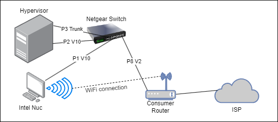

# HomeLabInABox

Automated deployment and configuration of a modular home lab

## One Button Deploy

After completing the bootstrapping checklist below, run the following command to get your home lab deployed.

```bash
bash <(curl -fsSL https://raw.githubusercontent.com/JustOneMoreDog/HomeLabInABox/homelab_in_a_box.sh)
```

## Bootstrapping

### Bootstrapping Setup Checklist 

In order to achieve this we will first need the human to do some manual labor.

  * Hypervisor
    * [ ] Only one hard drive is in place
    * [ ] Motherboard ethernet port connected to the switch on VLAN 10
    * [ ] PCI ethernet port connected to the switch on a Trunk port with allowed VLANs set to all
    * [ ] BIOS properly setup to handle Wake On LAN
    * [ ] BIOS set to boot off of network interface by default
  * Bootstrapper
    * [ ] Connected to the WiFi and able to talk out to the internet
    * [ ] Ethernet connection to the switch on VLAN 10
  * Consumer Router
    * [ ] Ethernet connection from the consumer router goes into a port on the switch that is on VLAN 2

### Example Setup



In the above example diagram we have the follow:

  * **Consumer Router**
    * We are assuming that wherever this project is being deployed at there is already an active internet connection with WiFi coverage. 
      * Since this is on my backup internet, T-Mobile 5G, I do not get access to a public IP or any port forwarding like I would with Verizon Fios. This means that one of the goals of the project will be handling inbound connections for things like the dashboards without the use of port forwarding. This will be a fun challenge and will also make it so that this can be deployed almost anywhere.
  * **Netgear Switch**
    * I am using a [`TP-Link TL-SG3210 v3`](https://www.amazon.com/gp/product/B092C1VM7T/) switch since it is low power, managed, small, cheap, and most importantly, has a CLI. 
    * We are expecting the switch to be pre-configured by the user. 
  * **Hypervisor**
    * The exact specs that should be used will be determined closer to the end of the project. For now I am using what was previously my Factorio server that has 64GB of DDR5 RAM, an Intel i5, and a 1TB PCI 3.0 nVME drive.
    * The networking for this hypervisor will involve two ethernet ports. The first is the NIC on the motherboard itself and will serve as the management interface. The second will be a NIC from a PCI card and will be the trunk between the virtual switch and the Netgear switch. 
  * **Bootstrapper**
    * I am currently using this [`Intel Nuc 11 NUC11ATKC4`](https://www.amazon.com/dp/B0BWMRJWGL) since it is cheap and has both WiFi and ethernet. 
    * I will be running Debian 12 since that seems reasonable.
    * The WiFi will be used as a WAN interface allowing the bootstrapper constant access to the internet. The ethernet will be the router for the management VLAN and will NAT the `10.10.10.0/24` network out its WiFi interface.
